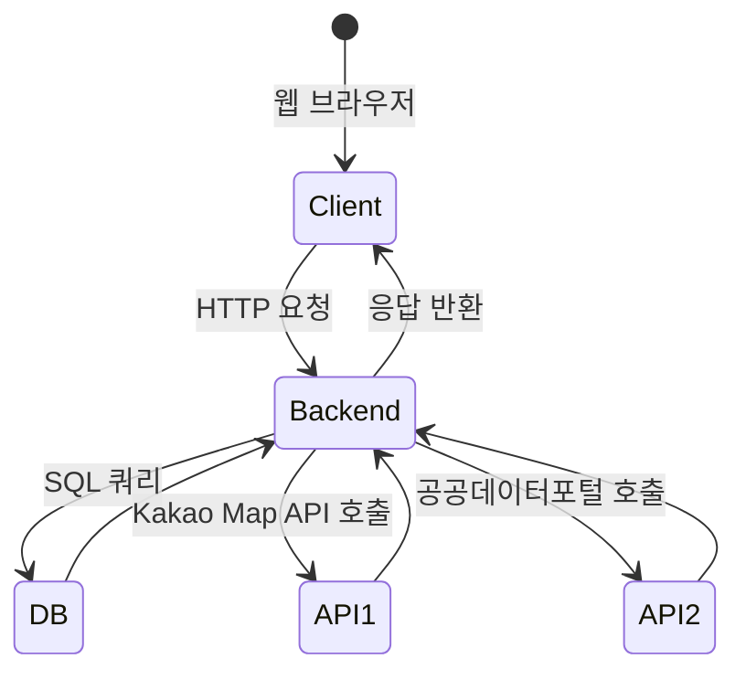
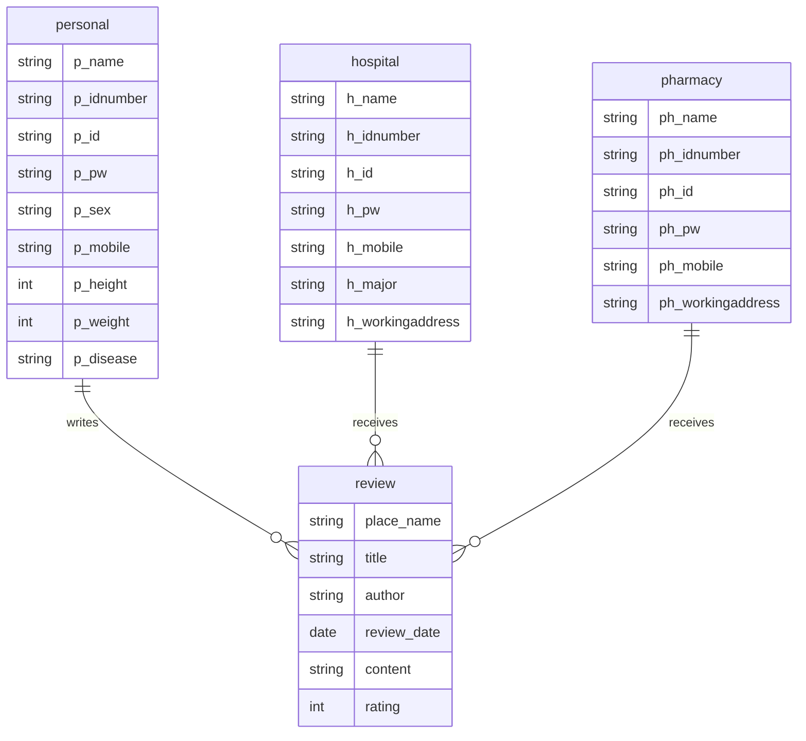

# 🏥 종합 의료 관리 서비스 

  

---

## 📌 프로젝트 개요
- **병원–약국–환자 데이터 통합**으로 의료 경험 혁신 및 효율적 관리  
- **디지털 처방전 관리, 병원/약국 검색, 리뷰 시스템**을 통한 환자 편의성 향상  
- **공공데이터 + Kakao Map API 연계**를 통한 실시간 의료 정보 제공  

---

## 👥 팀원 소개
- 김경민  
- 임회연  
- 변선우  

---

## 📑 목차
- [기술 스택](#기술-스택)
- [화면](#화면)
- [핵심 기능](#핵심-기능)
- [아키텍처](#아키텍처)
- [데이터 모델(ERD)](#데이터-모델erd)
- [API 개요](#api-개요)
- [내 역할 & 성과](#내-역할--성과)

---

## 기술 스택

  

---

## 화면

<table>
  <tr>
    <td align="center">
       
      ER 다이어그램
    </td>
    <td align="center">
       
      메인 화면
    </td>
  </tr>
  <tr>
    <td align="center">
       
      회원가입 화면1
    </td>
    <td align="center">
       
      회원가입 화면2
    </td>
  </tr>
  <tr>
    <td align="center">
       
      병원 검색
    </td>
    <td align="center">
       
      약국 검색
    </td>
  </tr>
  <tr>
    <td align="center">
       
      처방전 관리
    </td>
    <td align="center">
       
      리뷰 시스템
    </td>
  </tr>
  <tr>
    <td align="center">
       
      후기 확인
    </td>
    <td align="center">
       
      후기 작성
    </td>
  </tr>
</table>

---

## 핵심 기능

### 1) 회원별 접근 관리
- 환자, 병원, 약국 역할 기반 회원가입 및 로그인  
- 환자는 처방전 열람/다운로드, 리뷰 작성 가능  
- 병원/약국은 환자 정보 접근 및 처방전 관리  

### 2) 디지털 처방전 관리
- 환자가 안전하게 처방전 업로드 및 다운로드 가능  
- 다운로드 후 DB에서 자동 삭제 → 개인정보 보호  

### 3) 병원/약국 검색 + 리뷰
- Kakao Map API + 공공데이터포털 기반 병원/약국 정보 제공  
- 리뷰 열람 및 작성 가능 → 서비스 개선 활용  

---

## 아키텍처

---

## 데이터 모델(ERD)

---
## API 개요

| 메소드    | 경로                     | 설명               |
| ------ | ---------------------- | ---------------- |
| `POST` | `/signup`              | 회원가입             |
| `POST` | `/login`               | 로그인              |
| `GET`  | `/hospitals`           | 병원 검색 (공공데이터 연동) |
| `GET`  | `/pharmacies`          | 약국 검색 (공공데이터 연동) |
| `POST` | `/prescription/upload` | 처방전 업로드          |
| `GET`  | `/prescription/:id`    | 처방전 다운로드         |
| `POST` | `/review`              | 리뷰 작성            |
| `GET`  | `/review/:place`       | 리뷰 조회            |

---

## 내 역할 & 성과

- DB 및 ERD 설계/테이블 구축: Personal, Hospital, Pharmacy, Review 등 주요 테이블 구조 설계 및 관계 정의  
- 데이터 저장 및 처리: 환자/병원/약국/리뷰 데이터 저장 로직 및 SQL 쿼리 작성    
- 병원·약국 위치 검색 기능 구현: Kakao Map API + 공공데이터포털 연동 → 지도 기반 실시간 검색 가능  
- 리뷰/별점 시스템 구현: 특정 지점 검색 시 기존 리뷰 조회 + 후기 작성 및 별점 평가 기능 개발  
- 서비스 통합: 회원가입/로그인 → 병원·약국 검색 → 리뷰/처방전 관리까지 연결되는 전체 플로우 구축  
